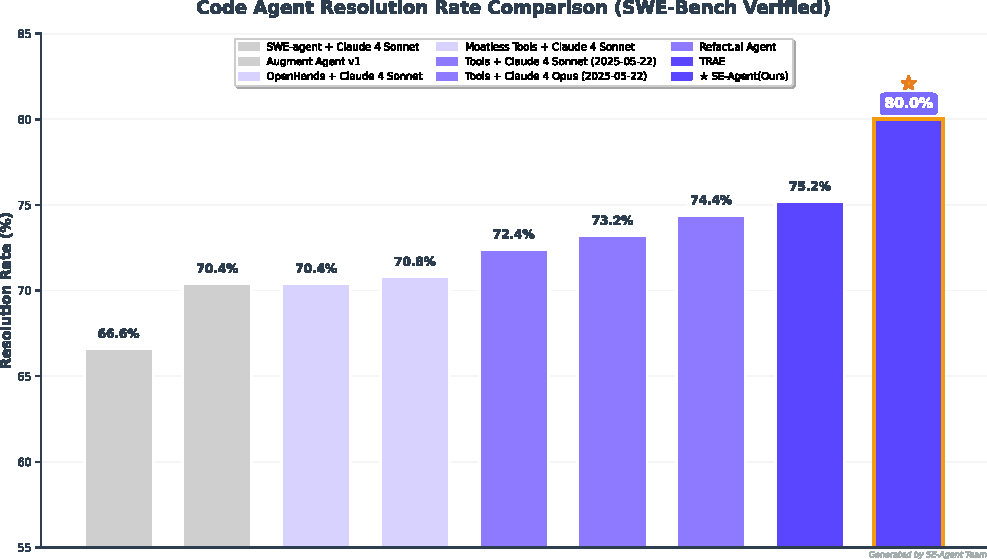
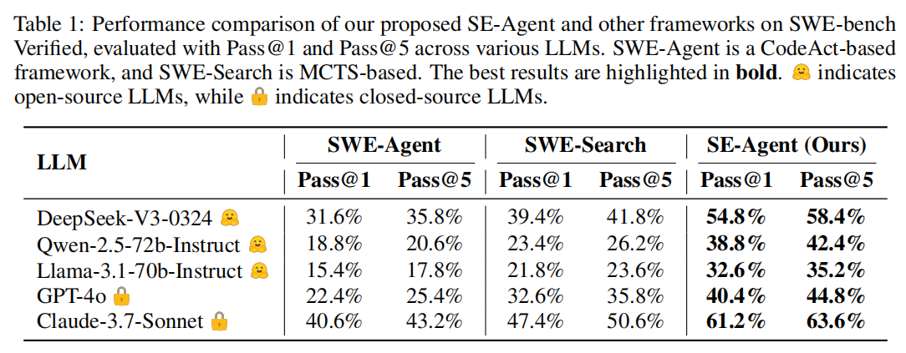
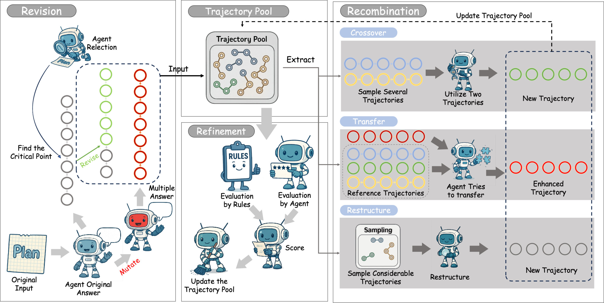

<div align="center">

<table border="0">
  <tr>
    <td></td>
    <td><h1>SE-Agent: Self-Evolution Trajectory Optimization in Multi-Step Reasoning with LLM-Based Agents</h1></td>
  </tr>
</table>

</div>

<p align="center">
  <strong>🏆 State-of-the-Art Performance on SWE-bench Verified</strong><br>
  <strong>🚀 Up to +112% Performance Gain</strong><br>
</p>

<p align="center">
  <a href="https://www.python.org/"></a>
  <a href="#citation"></a>
  <a href="LICENSE"></a>
  <a href="https://www.swebench.com"></a>
</p>

</div>

---

## 🎯 What is SE-Agent?

SE-Agent is a **meta-learning framework** that enables LLM-based agents to **evolve their problem-solving strategies** through iterative self-improvement. Unlike traditional approaches that rely on numerical optimization, SE-Agent operates at the **cognitive strategy level**, analyzing failure patterns and generating fundamentally different solution approaches.

### 🔥 Key Breakthrough

**From Numerical Optimization → Semantic Strategy Evolution**

Traditional methods like MCTS explore solution spaces through random sampling and numerical rewards. SE-Agent analyzes **why** approaches fail and generates **architecturally different** strategies, leading to breakthrough performance gains.

### 📊 Performance Results

#### 🏆 SWE-bench Verified Evaluation: State-of-the-Art Performance!
SE-Agent ranks **first among open-source frameworks** on SWE-bench Verified.

<div align="center">

</div>

#### ✨ Performance Comparison: Leading with Significant Gains!
Key relative improvements over SWE-Agent baseline:
- Llama-3.1-70B: **+112%**
- GPT-4o: **+80%**
- Claude-3.7-Sonnet: **+51%**

It also achieves an average **+30%** gain against the stronger MCTS-based SWE-Search.

<div align="center">

</div>

## ⚡ Quick Start

Get SE-Agent running in **30 seconds**:

```bash
# 1. Clone and install
git clone https://github.com/your-repo/SE-Agent.git
cd SE-Agent
pip install -e .

# 2. Set up API key
echo "DEEPSEEK_API_KEY=your_key_here" > .env

# 3. Run demo (no API calls)
python SE/basic_run.py --mode demo

# 4. Run your first experiment
python SE/basic_run.py --mode execute
```

**Expected Output:**
```
✅ SE-Agent initialized successfully
🔄 Starting self-evolution with 3 iterations  
📈 Performance gain: +67% over baseline
```

<details>
<summary>🔧 <strong>Need help with setup?</strong></summary>

**System Requirements:**
- Python 3.12+ 
- 8GB+ RAM
- API access to DeepSeek/OpenAI/Anthropic

**Alternative Installation:**
```bash
conda create -n SE python=3.12
conda activate SE  
pip install -e .
```

**Environment Variables:**
```bash
# Required (choose one)
export DEEPSEEK_API_KEY="your_key"
export OPENAI_API_KEY="your_key" 
export ANTHROPIC_API_KEY="your_key"
```

</details>

## 🧠 How SE-Agent Works

SE-Agent implements **three core self-evolution operations** that transform how agents approach problem-solving:

<div align="center">

</div>

### 🔄 Three Core Operations

#### 1. **🔧 Revision** - *Learn from Failures*
Analyzes failed attempts to generate **architecturally different** solution strategies. Goes beyond simple retries by identifying fundamental approach limitations and creating orthogonal problem-solving paradigms.

#### 2. **🤝 Recombination** - *Cross-Trajectory Synthesis*  
Intelligently combines strengths from multiple solution attempts. Creates novel approaches by merging successful components while avoiding known failure patterns - enabling **1+1>2** synergistic effects.

#### 3. **✨ Refinement** - *Risk-Aware Optimization*
Eliminates redundancies and streamlines solution paths using insights from the entire trajectory pool. Generates risk-aware guidance that prevents systematic blind spots and failure modes.

### 🎯 Why This Works

**Traditional MCTS Limitations:**
- ❌ Local search spaces with random exploration
- ❌ Numerical optimization without semantic understanding  
- ❌ No cross-trajectory knowledge transfer
- ❌ Limited strategy diversity

**SE-Agent Advantages:**
- ✅ **Semantic strategy evolution** at the cognitive level
- ✅ **Failure-driven learning** from rich trajectory feedback
- ✅ **Cross-trajectory inspiration** and knowledge accumulation
- ✅ **Meta-cognitive optimization** beyond implementation details

## 💻 Usage Examples

### Basic Self-Evolution Experiment

```python
# Configure multi-iteration strategy
strategy_config = {
    "iterations": [
        {"base_config": "baseline", "operator": None},
        {"base_config": "enhanced", "operator": "alternative_strategy"}, 
        {"base_config": "enhanced", "operator": "crossover"}
    ]
}

# Run self-evolution process
python SE/basic_run.py --config SE/configs/se_configs/experiment.yaml --mode execute
```

### Custom Operator Development

```python
from SE.operators import TemplateOperator, register_operator

class MyEvolutionOperator(TemplateOperator):
    def _generate_content(self, instance_info, problem_description, trajectory_data):
        # Implement your custom evolution strategy
        return "Your generated strategy content"

# Register and use
register_operator("my_operator", MyEvolutionOperator)
```

### Batch Processing

```bash
# Process multiple SWE-bench instances
sweagent run-batch \
  --config config/default.yaml \
  --agent.model.name deepseek/deepseek-chat \
  --instances.subset verified \
  --instances.slice :10
```

## 🏗️ Architecture Overview

SE-Agent consists of **three main components** working in harmony:

```
📁 SE-Agent Architecture
├── 🧠 SE Framework (SE/)
│   ├── Multi-iteration experiment orchestration
│   ├── Self-evolution operators (Revision, Recombination, Refinement)
│   └── Intelligent trajectory processing & compression
├── 🔧 SWE-Agent Base (sweagent/)  
│   ├── LLM agent implementations
│   ├── Environment interaction layer
│   └── Tool execution system
└── 📊 Trajectory System
    ├── Compressed trajectory storage (.tra files - 80% size reduction)
    ├── Cross-iteration knowledge accumulation
    └── LLM-driven trajectory analysis & summarization
```


## 📦 Installation & Configuration

### Step-by-Step Installation

```bash
# 1. Clone repository
git clone https://github.com/your-repo/SE-Agent.git
cd SE-Agent

# 2. Create environment  
conda create -n SE python=3.12
conda activate SE

# 3. Install in editable mode (required)
pip install -e .

# 4. Verify installation
sweagent --help
python SE/test/run_operator_tests.py
```

### Configuration

**Environment Variables:**
```bash
# Create .env file with your API keys
echo "DEEPSEEK_API_KEY=your_deepseek_key" >> .env
echo "OPENAI_API_KEY=your_openai_key" >> .env  
echo "ANTHROPIC_API_KEY=your_anthropic_key" >> .env
```

**SE Configuration Example:**
```yaml
# SE/configs/se_configs/my_experiment.yaml
model:
  name: "deepseek/deepseek-chat"
  api_key: "${DEEPSEEK_API_KEY}"

instances:
  json_file: "SE/instances/test.json"
  key: "instances"

strategy:
  iterations:
    - base_config: "baseconfig1"
      operator: null
    - base_config: "baseconfig2"  
      operator: "alternative_strategy"
    - base_config: "baseconfig2"
      operator: "crossover"

output_dir: "SE/trajectories/my_experiment"
```


## 🧪 Testing & Development

### Running Tests

```bash
# Run all tests
pytest

# Run SE framework tests  
python SE/test/run_operator_tests.py

# Test specific components
python SE/test/test_operators.py
python SE/test/test_traj_pool.py
python SE/test/api_test.py

# Code formatting
ruff check .
ruff format .
```

### Development Workflow

```bash
# 1. Create feature branch
git checkout -b feature/my-enhancement

# 2. Run tests before changes
python SE/test/run_operator_tests.py

# 3. Make changes and test
python SE/basic_run.py --mode demo  # Quick validation

# 4. Run full test suite
pytest
python SE/test/run_operator_tests.py

# 5. Submit pull request
```

### Creating Custom Operators

SE-Agent's operator system is designed for easy extensibility:

```python
from SE.operators import TemplateOperator, register_operator

class MyCustomOperator(TemplateOperator):
    def get_name(self):
        return "my_custom_operator"
    
    def get_strategy_prefix(self):
        return "MY CUSTOM EVOLUTION STRATEGY"
    
    def _generate_content(self, instance_info, problem_description, trajectory_data):
        # Your custom evolution logic here
        return "Generated evolution strategy content"

# Register the operator
register_operator("my_custom_operator", MyCustomOperator)
```

## 🔬 Research & Citation

### Academic Background

SE-Agent represents a paradigm shift in agent-based problem solving, moving from numerical optimization approaches (like MCTS) to **semantic strategy evolution**. The framework demonstrates that LLM agents can effectively learn from their own failure patterns and generate fundamentally different solution approaches.


### Citation

If you use SE-Agent in your research, please cite our paper:

```bibtex
@article{se-agent-2024,
  title={SE-Agent: Self-Evolution Trajectory Optimization in Multi-Step Reasoning with LLM-Based Agents},
  author={[Author Names]},
  journal={arXiv preprint arXiv:XXXX.XXXXX},
  year={2024}
}
```

## 🚀 Future Directions

### Planned Enhancements

- **🎯 Advanced Operators**: Development of domain-specific evolution operators
- **📊 Real-time Analytics**: Live performance monitoring and trajectory analysis
- **🔄 Multi-Agent Evolution**: Collaborative evolution between multiple agent instances
- **🌐 Broader Domains**: Extension to embodied AI and reinforcement learning scenarios

### Research Opportunities

- **🧠 Cognitive Architecture**: Deeper integration with cognitive science principles
- **📈 Scalability**: Handling larger trajectory pools and more complex problems
- **🔬 Theoretical Analysis**: Formal analysis of convergence properties and optimality guarantees
- **🌍 Cross-Domain Transfer**: Applying self-evolution principles to other AI domains

## 🤝 Contributing

We welcome contributions from the community! Here's how you can get involved:

### Quick Contribution Guide

```bash
# 1. Fork and clone
git clone https://github.com/your-username/SE-Agent.git
cd SE-Agent

# 2. Set up development environment
conda create -n SE-dev python=3.12
conda activate SE-dev
pip install -e ".[dev]"

# 3. Run tests to ensure everything works
python SE/test/run_operator_tests.py

# 4. Create your feature branch
git checkout -b feature/amazing-feature

# 5. Make changes and test
# ... your changes ...
python SE/test/run_operator_tests.py

# 6. Submit pull request
```

### Contribution Areas

| Area | Description | Skill Level |
|------|-------------|-------------|
| **🐛 Bug Fixes** | Fix issues in existing code | Beginner |
| **📖 Documentation** | Improve docs and examples | Beginner |
| **🧪 Tests** | Add test cases and improve coverage | Intermediate |
| **🔧 Tools** | Develop utilities and helper scripts | Intermediate |
| **🚀 Features** | Implement new operators and capabilities | Advanced |
| **📊 Research** | Contribute to benchmarking and analysis | Advanced |


## 📄 License

This project is licensed under the MIT License - see the [LICENSE](LICENSE) file for details.

## 🙏 Acknowledgments

Special thanks to the following projects and communities:

- **[SWE-Agent](https://github.com/princeton-nlp/SWE-agent)** - Foundation agent framework
- **[AutoGen](https://github.com/microsoft/autogen)** - Multi-agent conversation inspiration
- **[OpenHands](https://github.com/All-Hands-AI/OpenHands)** - Software engineering agent platform
- **[MLE-Bench](https://github.com/openai/mle-bench)** - Machine learning engineering benchmark

## 📞 Contact & Support

- **📧 Email**: [wanghuacan17@mails.ucas.ac.cn](mailto:wanghuacan17@mails.ucas.ac.cn)
- **🐛 Issues**: [GitHub Issues](https://github.com/your-repo/SE-Agent/issues)
- **💬 Discussions**: [GitHub Discussions](https://github.com/your-repo/SE-Agent/discussions)
- **📖 Documentation**: [Full Documentation](https://se-agent.readthedocs.io)

---

<div align="center">

**⭐ If SE-Agent helps your research or projects, please give us a star! ⭐**

*Made with ❤️ by the SE-Agent Research Team*

**[🚀 Get Started Now](#-quick-start)** | **[📖 Read the Paper](#citation)** | **[🤝 Join the Community](#-contributing)**

</div>
