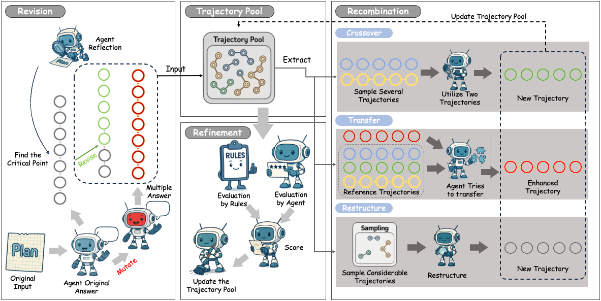
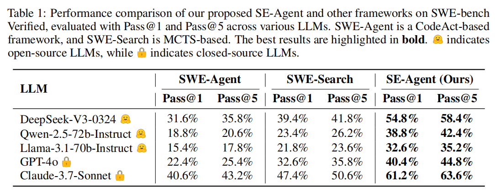

<div align="center">

<table border="0">
  <tr>
    <td></td>
    <td><h1>SE-Agent: Self-Evolution Trajectory Optimization in Multi-Step Reasoning with LLM-Based Agents</h1></td>
  </tr>
</table>

</div>

<div align="center">

[](https://www.python.org/) [](LICENSE) [](https://github.com/anonymous/SE-Agent)

</div>

> **📢 Important Notice**: The complete source code will be open-sourced after paper publication. Currently, we provide project demonstrations and partial code examples.

## 🎯 Overview

Large Language Model (LLM)-based agents have recently shown impressive capabilities in complex reasoning and tool use via multi-step interactions with their environments. While these agents have the potential to tackle complicated tasks, their problem-solving process—agents' interaction trajectory leading to task completion—remains underexploited. These trajectories contain rich feedback that can navigate agents toward the right directions for solving problems correctly.

Although prevailing approaches, such as Monte Carlo Tree Search (MCTS), can effectively balance exploration and exploitation, they ignore the interdependence among various trajectories and lack the diversity of search spaces, which leads to redundant reasoning and suboptimal outcomes. To address these challenges, we propose SE-Agent, a Self-Evolution framework that enables Agents to optimize their reasoning processes iteratively.

### 🧠 SE-Agent Framework

<div align="center">

</div>

### 📊 Performance Results

#### 🏆 SWE-bench Verified Evaluation: State-of-the-Art Performance!
SE-Agent ranks **first among open-source frameworks** on SWE-bench Verified (as of May 16, 2025).

<div align="center">

</div>

#### ✨ Performance Comparison: Leading with Significant Gains!
Key relative improvements over SWE-Agent baseline:
- Llama-3.1-70B: **+112%**
- GPT-4o: **+80%**
- Claude-3.7-Sonnet: **+51%**

It also achieves an average **+30%** gain against the stronger MCTS-based SWE-Search. SE-Agent demonstrates **substantial, consistent gains** and **generalizability** across diverse LLMs.

<div align="center">

</div>

### 🔄 Core Methodology

Our approach revisits and enhances former pilot trajectories through three key operations:

#### ✍️ Revision
Enhancing individual trajectories through **self-reflection** and **targeted improvement**. This involves analyzing a single trajectory to identify errors or inefficiencies and then prompting the agent to correct these specific issues, leading to a more refined path.

#### 🤝 Recombination
Creating new trajectories by **combining strengths** from multiple existing paths. This is where **cross-trajectory inspiration** primarily occurs. SE-Agent intelligently selects high-performing segments from different trajectories and merges them to construct a novel, potentially superior trajectory. This process explicitly leverages the interdependence of various attempts, allowing successes in one area to compensate for shortcomings in others.

#### ✨ Refinement
Optimizing promising trajectories by **eliminating redundancies** and **enhancing efficiency**. After new trajectories are formed, this step further hones them by removing unnecessary steps or streamlining sequences of actions, guided by the lessons learned from the entire pool of explored trajectories.

### 🚀 Key Advantages
This evolutionary mechanism enables two critical advantages:

1.  It **expands the search space** beyond local optima by intelligently exploring diverse solution paths guided by previous trajectories. The generation of new paths via revision and recombination prevents the agent from getting stuck in a single, suboptimal line of reasoning.
2.  It leverages **cross-trajectory inspiration** to efficiently enhance performance while **mitigating the impact of suboptimal reasoning paths**. By learning from a diverse set of attempts, the system can identify patterns of success and failure. The recombination process inherently prefers successful segments, while the analysis of suboptimal paths informs future revisions and helps avoid repeating mistakes. 
3.  This is not strictly "adversarial" in the sense of game theory, but rather a form of **contrastive learning** from both positive and negative examples within the trajectory pool. The framework evaluates the collective experience to guide the evolution of strategies.

### 🔮 Future Work
SE-Agent demonstrates the value of self-evolutionary principles in agent design. Looking forward, we aim to extend this paradigm to a wider spectrum of path-search problems, including DeepSearch frameworks, reinforcement-learning policy discovery, and embodied-intelligence scenarios where agents must reason and act in physical environments.

## ⚙️ Configuration

You can follow the original [README_SWE_Agent.md](https://swe-agent.com/latest/installation/source/) for direct configuration. An `environment.yml` file is also provided to help you replicate the exact same environment:

```bash
conda env create -f environment.yml
```
But create env in this way wouldn't install sweagent in an editable mode!! You need to make sure sweagent installed editably which always generate a sweagent.egg-info in your workspace. 
Also my env installl follow the insturctions below
```bash
conda env create -n SWE python=3.12
conda activate SWE
python -m pip install --upgrade pip && pip install --editable .
```
and use the conda default channel.


Let's run a quick check to ensure everything is working:

```bash
sweagent --help
```

## Basic Example

Start with a simple example to solve an issue related to a syntax error ([`swe-agent/test-repo #1`](https://github.com/SWE-agent/test-repo/issues/1)):

```bash
sweagent run \
  --agent.model.name=claude-3-5-sonnet-20241022 \
  --agent.model.per_instance_cost_limit=2.00 \
  --env.repo.github_url=https://github.com/SWE-agent/test-repo \
  --problem_statement.github_url=https://github.com/SWE-agent/test-repo/issues/1
```
or Deepseek-Chat
```bash
sweagent run \
  --agent.model.name=deepseek/deepseek-chat \
  --agent.model.per_instance_cost_limit=2.00 \
  --env.repo.github_url=https://github.com/SWE-agent/test-repo \
  --problem_statement.github_url=https://github.com/SWE-agent/test-repo/issues/1
```
The example above uses the `Claude 3.5 Sonnet` model from Anthropic. Alternatively, you can use `GPT-4o` (from OpenAI) by setting `--agent.model.name=gpt-4o`. To use these models, you need to add your API keys to the environment:

```bash
export ANTHROPIC_API_KEY=<your_key>
export OPENAI_API_KEY=<your_key>
export DEEPSEEK_API_KEY=<your_key>
```

Alternatively, you can create a `.env` file in your working directory and add your keys:

```
ANTHROPIC_API_KEY=<your_key>
DEEPSEEK_API_KEY=<your_key>
```

**I think we only need to configure `DEEPSEEK_API_KEY`.** 

## Batch Mode Testing

Run multiple instances in batch mode:

```bash
sweagent run-batch \
  --config config/default.yaml \
  --agent.model.name deepseek/deepseek-chat \
  --num_workers 1 \
  --agent.model.per_instance_cost_limit 2.00 \
  --instances.type swe_bench \
  --instances.subset verified \
  --instances.split test \
  --instances.slice :1 \
  --instances.shuffle=True
```

This will run the instance `django__django-14672` and create trajectory files.

## Modifications

Compared to the original SWE_Agent repository, the following modifications have been made:

- Removed document files
- Removed frontend files
- Removed test files
- Added an extract_dataset_instance_id tool
- Optimized trajectory saving by adding timestamps to the save paths. This prevents overwriting previous outputs, which was an issue where `preds.json` would be overwritten if using the same model, configuration, and dataset.

## Record Folder Structure

Additionally, a `record` folder has been added to store experimental results. This folder can be used to keep baseline results and significant experimental data.

```
record/
└── {User_Name}/
    └── {Model}_{Dataset}/
        ├── report.txt
        ├── preds.json    # Output from the framework
        └── results.json  # Results generated by SWE-Bench after evaluation
```


## 🤝 Contributing

We welcome community contributions! Please refer to the following guidelines:

### Development Setup

```bash
git clone https://github.com/anonymous/SE-Agent.git
cd SE-Agent
pip install -e ".[dev]"
```

### Contribution Types

- 🐛 Bug fixes
- ✨ New feature development
- 📚 Documentation improvements
- 🧪 Test case additions
- 🔧 Tools and utilities

## 📄 License
This project is licensed under the MIT License - see the [LICENSE](LICENSE) file for details.

## 🙏 Acknowledgments
Thanks to the following projects and communities for inspiration and support:
- [AutoGen](https://github.com/microsoft/autogen) - Multi-agent conversation framework
- [OpenHands](https://github.com/All-Hands-AI/OpenHands) - Software engineering agent platform  
- [SWE-Agent](https://github.com/princeton-nlp/SWE-agent) - GitHub issue solving agent
- [MLE-Bench](https://github.com/openai/mle-bench) - Machine learning engineering benchmark

## 📚 Citation
If you use SE-Agent in your research, please cite our paper:

## 📞 Contact Us

- 📧 Email: [wanghuacan17@mails.ucas.ac.cn]

---

<div align="center">

**⭐ If SE-Agent helps you, please give us a star!**

Made with ❤️ by the SE-Agent Team

</div>
