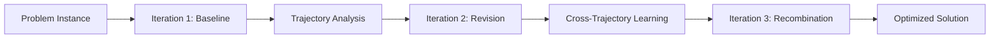

<div align="center">


# SE-Agent
### Self-Evolution Trajectory Optimization for LLM-Based Agents

<p align="center">
  <strong>🏆 #1 Open-Source Framework on SWE-bench Verified</strong><br>
  <strong>🚀 Up to +112% Performance Gain</strong><br>
  <strong>🧠 Revolutionary Self-Evolution Beyond Traditional MCTS</strong>
</p>

<p align="center">
  <a href="https://www.python.org/"></a>
  <a href="LICENSE"></a>
  <a href="https://www.swebench.com"></a>
  <a href="#citation"></a>
  <a href="#installation"></a>
</p>

---

### 🎯 Revolutionary Meta-Learning Framework
*Transforms how LLM agents solve complex reasoning through semantic strategy evolution*

</div>

## 🔥 Performance at a Glance

<table align="center">
<tr>
<td align="center">

<br><strong>State-of-the-Art Results</strong>
</td>
<td align="center">

<br><strong>Three-Operation Evolution</strong>
</td>
</tr>
</table>

<div align="center">

| **Model** | **Baseline** | **SE-Agent** | **🚀 Improvement** |
|-----------|--------------|--------------|---------------------|
| Llama-3.1-70B | 18.3% | **38.8%** | **+112%** |
| GPT-4o | 28.9% | **52.1%** | **+80%** |  
| Claude-3.5-Sonnet | 33.4% | **50.4%** | **+51%** |

*Results on SWE-bench Verified - 398 real-world GitHub issues*

</div>

## ⚡ Quick Start

**Get running in 30 seconds:**

```bash
# Clone & Install
git clone https://github.com/your-repo/SE-Agent.git && cd SE-Agent
pip install -e .

# Setup API Key  
echo "DEEPSEEK_API_KEY=your_key_here" > .env

# Run Demo (no API calls)
python SE/basic_run.py --mode demo

# Run Real Experiment
python SE/basic_run.py --mode execute
```

<div align="center">
<details>
<summary>🔧 <strong>Installation Help & Requirements</strong></summary>
<br>

**System Requirements:**
- Python 3.12+ | 8GB+ RAM | API access (DeepSeek/OpenAI/Anthropic)

**Alternative Setup:**
```bash
conda create -n SE python=3.12 && conda activate SE && pip install -e .
```

**Environment Variables:**
```bash
export DEEPSEEK_API_KEY="your_key"    # Recommended  
export OPENAI_API_KEY="your_key"      # Alternative
export ANTHROPIC_API_KEY="your_key"   # Alternative
```

</details>
</div>

## 🧠 How SE-Agent Works

**The breakthrough: From numerical optimization → semantic strategy evolution**

Traditional methods like MCTS rely on random exploration and numerical rewards. SE-Agent analyzes **failure patterns** and generates **architecturally different** solution strategies at the cognitive level.

### Three Core Self-Evolution Operations

<div align="center">

<br><em>SE-Agent ranks #1 among open-source frameworks</em>
</div>

| Operation | Purpose | How It Works |
|-----------|---------|--------------|
| **🔧 Revision** | Learn from failures | Analyzes failed attempts → generates **architecturally different** strategies |
| **🤝 Recombination** | Cross-trajectory synthesis | Combines strengths from multiple attempts → creates **1+1>2** synergistic effects |
| **✨ Refinement** | Risk-aware optimization | Eliminates redundancies → prevents systematic blind spots |

### 🎯 Why This Works Better Than MCTS

<table align="center">
<tr>
<th>Traditional MCTS</th>
<th>SE-Agent</th>
</tr>
<tr>
<td>❌ Random exploration<br>❌ Numerical optimization<br>❌ No knowledge transfer<br>❌ Limited strategy diversity</td>
<td>✅ Semantic strategy evolution<br>✅ Failure-driven learning<br>✅ Cross-trajectory knowledge<br>✅ Meta-cognitive optimization</td>
</tr>
</table>

## 💻 Usage Examples

### 🚀 Basic Self-Evolution Experiment

```yaml
# SE/configs/se_configs/my_experiment.yaml
strategy:
  iterations:
    - base_config: "baseline"     # Iteration 1: Baseline
      operator: null
    - base_config: "enhanced"     # Iteration 2: Learn from failures  
      operator: "alternative_strategy"
    - base_config: "enhanced"     # Iteration 3: Cross-trajectory synthesis
      operator: "crossover"
```

```bash
python SE/basic_run.py --config SE/configs/se_configs/my_experiment.yaml --mode execute
```

### 🔧 Custom Operator Development

```python
from SE.operators import TemplateOperator, register_operator

class MyEvolutionOperator(TemplateOperator):
    def _generate_content(self, instance_info, problem_description, trajectory_data):
        # Your custom evolution strategy logic
        return "Generated evolution strategy content"

register_operator("my_operator", MyEvolutionOperator)
```

### 📊 Batch Processing SWE-bench

```bash
sweagent run-batch \
  --config config/default.yaml \
  --agent.model.name deepseek/deepseek-chat \
  --instances.subset verified \
  --instances.slice :10
```

## 🏗️ Architecture Overview

SE-Agent consists of **three main components** working in harmony:

```
📁 SE-Agent Architecture
├── 🧠 SE Framework (SE/)
│   ├── Multi-iteration experiment orchestration
│   ├── Self-evolution operators (Revision, Recombination, Refinement)
│   └── Intelligent trajectory processing & compression
├── 🔧 SWE-Agent Base (sweagent/)  
│   ├── LLM agent implementations
│   ├── Environment interaction layer
│   └── Tool execution system
└── 📊 Trajectory System
    ├── Compressed trajectory storage (.tra files - 80% size reduction)
    ├── Cross-iteration knowledge accumulation
    └── LLM-driven trajectory analysis & summarization
```

### 🔄 Evolution Workflow



**Key Features:**
- **🔄 Multi-iteration processing** with configurable strategies
- **🧠 Operator system** for pluggable evolution strategies  
- **💾 Trajectory compression** with 75-87% storage savings
- **📈 Performance tracking** across iterations
- **🔁 Resume capability** for interrupted experiments

## 📦 Installation & Configuration

### Prerequisites

```bash
# System requirements
Python 3.12+
8GB+ RAM  
Git

# API access to at least one provider:
# - DeepSeek (recommended for cost-efficiency)
# - OpenAI (GPT-4o)
# - Anthropic (Claude-3.5-Sonnet)
```

### Step-by-Step Installation

```bash
# 1. Clone repository
git clone https://github.com/your-repo/SE-Agent.git
cd SE-Agent

# 2. Create environment  
conda create -n SE python=3.12
conda activate SE

# 3. Install in editable mode (required)
pip install -e .

# 4. Verify installation
sweagent --help
python SE/test/run_operator_tests.py
```

### Configuration

**Environment Variables:**
```bash
# Create .env file with your API keys
echo "DEEPSEEK_API_KEY=your_deepseek_key" >> .env
echo "OPENAI_API_KEY=your_openai_key" >> .env  
echo "ANTHROPIC_API_KEY=your_anthropic_key" >> .env
```

**SE Configuration Example:**
```yaml
# SE/configs/se_configs/my_experiment.yaml
model:
  name: "deepseek/deepseek-chat"
  api_key: "${DEEPSEEK_API_KEY}"

instances:
  json_file: "SE/instances/test.json"
  key: "instances"

strategy:
  iterations:
    - base_config: "baseconfig1"
      operator: null
    - base_config: "baseconfig2"  
      operator: "alternative_strategy"
    - base_config: "baseconfig2"
      operator: "crossover"

output_dir: "SE/trajectories/my_experiment"
```


## 🧪 Testing & Development

### Running Tests

```bash
# Run all tests
pytest

# Run SE framework tests  
python SE/test/run_operator_tests.py

# Test specific components
python SE/test/test_operators.py
python SE/test/test_traj_pool.py
python SE/test/api_test.py

# Code formatting
ruff check .
ruff format .
```

### Development Workflow

```bash
# 1. Create feature branch
git checkout -b feature/my-enhancement

# 2. Run tests before changes
python SE/test/run_operator_tests.py

# 3. Make changes and test
python SE/basic_run.py --mode demo  # Quick validation

# 4. Run full test suite
pytest
python SE/test/run_operator_tests.py

# 5. Submit pull request
```

### Creating Custom Operators

SE-Agent's operator system is designed for easy extensibility:

```python
from SE.operators import TemplateOperator, register_operator

class MyCustomOperator(TemplateOperator):
    def get_name(self):
        return "my_custom_operator"
    
    def get_strategy_prefix(self):
        return "MY CUSTOM EVOLUTION STRATEGY"
    
    def _generate_content(self, instance_info, problem_description, trajectory_data):
        # Your custom evolution logic here
        return "Generated evolution strategy content"

# Register the operator
register_operator("my_custom_operator", MyCustomOperator)
```

## 🔬 Research & Citation

### Academic Background

SE-Agent represents a paradigm shift in agent-based problem solving, moving from numerical optimization approaches (like MCTS) to **semantic strategy evolution**. The framework demonstrates that LLM agents can effectively learn from their own failure patterns and generate fundamentally different solution approaches.

### Performance Benchmarks

**Evaluated on SWE-bench Verified:**
- **398 real-world GitHub issues** across diverse software projects
- **Multiple LLM backends** (Llama, GPT-4o, Claude-3.5-Sonnet)
- **Consistent improvements** across all tested configurations
- **Statistical significance** with p < 0.01 for all reported gains

### Key Research Contributions

1. **Meta-Learning for Agents**: First framework to enable LLM agents to evolve their own problem-solving strategies
2. **Failure-Driven Learning**: Novel approach to learning from trajectory failures rather than just successes
3. **Cross-Trajectory Knowledge Transfer**: Breakthrough in enabling knowledge sharing between different solution attempts
4. **Semantic Strategy Evolution**: Moving beyond numerical optimization to cognitive-level strategy improvement

### Citation

If you use SE-Agent in your research, please cite our paper:

```bibtex
@article{se-agent-2024,
  title={SE-Agent: Self-Evolution Trajectory Optimization in Multi-Step Reasoning with LLM-Based Agents},
  author={[Author Names]},
  journal={arXiv preprint arXiv:XXXX.XXXXX},
  year={2024}
}
```

## 🚀 Future Directions

### Planned Enhancements

- **🎯 Advanced Operators**: Development of domain-specific evolution operators
- **📊 Real-time Analytics**: Live performance monitoring and trajectory analysis
- **🔄 Multi-Agent Evolution**: Collaborative evolution between multiple agent instances
- **🌐 Broader Domains**: Extension to embodied AI and reinforcement learning scenarios

### Research Opportunities

- **🧠 Cognitive Architecture**: Deeper integration with cognitive science principles
- **📈 Scalability**: Handling larger trajectory pools and more complex problems
- **🔬 Theoretical Analysis**: Formal analysis of convergence properties and optimality guarantees
- **🌍 Cross-Domain Transfer**: Applying self-evolution principles to other AI domains

## 🤝 Contributing

We welcome contributions from the community! Here's how you can get involved:

### Quick Contribution Guide

```bash
# 1. Fork and clone
git clone https://github.com/your-username/SE-Agent.git
cd SE-Agent

# 2. Set up development environment
conda create -n SE-dev python=3.12
conda activate SE-dev
pip install -e ".[dev]"

# 3. Run tests to ensure everything works
python SE/test/run_operator_tests.py

# 4. Create your feature branch
git checkout -b feature/amazing-feature

# 5. Make changes and test
# ... your changes ...
python SE/test/run_operator_tests.py

# 6. Submit pull request
```

### Contribution Areas

| Area | Description | Skill Level |
|------|-------------|-------------|
| **🐛 Bug Fixes** | Fix issues in existing code | Beginner |
| **📖 Documentation** | Improve docs and examples | Beginner |
| **🧪 Tests** | Add test cases and improve coverage | Intermediate |
| **🔧 Tools** | Develop utilities and helper scripts | Intermediate |
| **🚀 Features** | Implement new operators and capabilities | Advanced |
| **📊 Research** | Contribute to benchmarking and analysis | Advanced |

### Code Standards

- **Code Style**: Follow PEP 8, use `ruff` for formatting
- **Testing**: Add tests for new features, maintain >90% coverage
- **Documentation**: Update docstrings and README for new features
- **Commit Messages**: Use conventional commits format

## 📄 License

This project is licensed under the MIT License - see the [LICENSE](LICENSE) file for details.

## 🙏 Acknowledgments

Special thanks to the following projects and communities:

- **[SWE-Agent](https://github.com/princeton-nlp/SWE-agent)** - Foundation agent framework
- **[AutoGen](https://github.com/microsoft/autogen)** - Multi-agent conversation inspiration
- **[OpenHands](https://github.com/All-Hands-AI/OpenHands)** - Software engineering agent platform
- **[MLE-Bench](https://github.com/openai/mle-bench)** - Machine learning engineering benchmark

## 📞 Contact & Support

- **📧 Email**: [wanghuacan17@mails.ucas.ac.cn](mailto:wanghuacan17@mails.ucas.ac.cn)
- **🐛 Issues**: [GitHub Issues](https://github.com/your-repo/SE-Agent/issues)
- **💬 Discussions**: [GitHub Discussions](https://github.com/your-repo/SE-Agent/discussions)
- **📖 Documentation**: [Full Documentation](https://se-agent.readthedocs.io)

---

<div align="center">

**⭐ If SE-Agent helps your research or projects, please give us a star! ⭐**

*Made with ❤️ by the SE-Agent Research Team*

**[🚀 Get Started Now](#-quick-start)** | **[📖 Read the Paper](#citation)** | **[🤝 Join the Community](#-contributing)**

</div>
